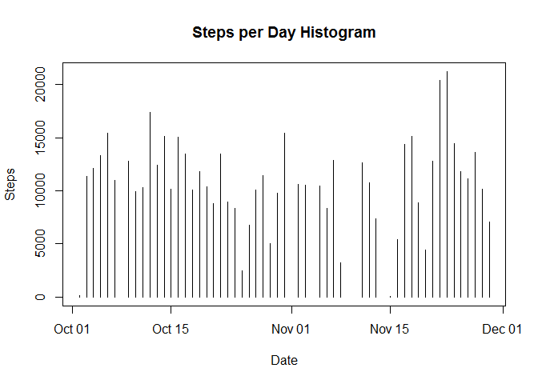
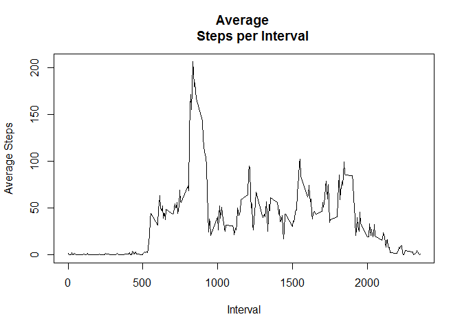
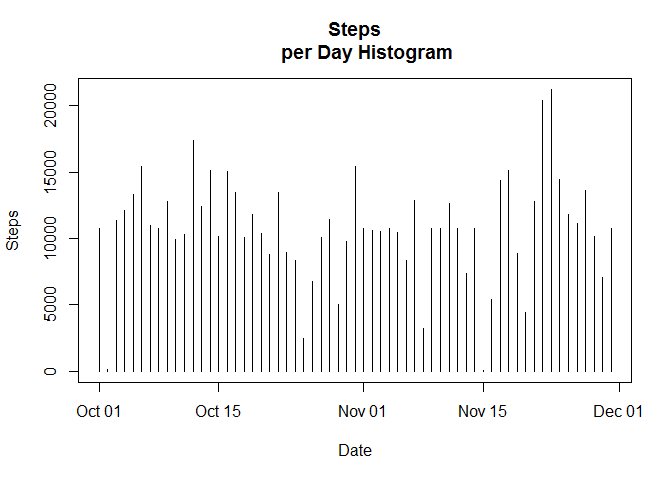

# Reproducible Research - Course Project 1
Aron O'Connor  
August 22, 2016  


# Loading and Preprocessing Data
Load the activity.csv file from the working directory:


```r
activity <- read.csv("activity.csv")
activity$date <- as.Date(activity$date, "%Y-%m-%d")
```

# Mean Steps Per Day
Calculate the total number of steps taken per day, make a histogram of the total 
number of steps taken per day, and report the mean and median of the total number
of steps taken per day:


```r
activity_agg <- aggregate(activity$steps ~ activity$date,activity,sum)
names(activity_agg) <- c("date","steps")
activity_agg
```

```
##          date steps
## 1  2012-10-02   126
## 2  2012-10-03 11352
## 3  2012-10-04 12116
## 4  2012-10-05 13294
## 5  2012-10-06 15420
## 6  2012-10-07 11015
## 7  2012-10-09 12811
## 8  2012-10-10  9900
## 9  2012-10-11 10304
## 10 2012-10-12 17382
## 11 2012-10-13 12426
## 12 2012-10-14 15098
## 13 2012-10-15 10139
## 14 2012-10-16 15084
## 15 2012-10-17 13452
## 16 2012-10-18 10056
## 17 2012-10-19 11829
## 18 2012-10-20 10395
## 19 2012-10-21  8821
## 20 2012-10-22 13460
## 21 2012-10-23  8918
## 22 2012-10-24  8355
## 23 2012-10-25  2492
## 24 2012-10-26  6778
## 25 2012-10-27 10119
## 26 2012-10-28 11458
## 27 2012-10-29  5018
## 28 2012-10-30  9819
## 29 2012-10-31 15414
## 30 2012-11-02 10600
## 31 2012-11-03 10571
## 32 2012-11-05 10439
## 33 2012-11-06  8334
## 34 2012-11-07 12883
## 35 2012-11-08  3219
## 36 2012-11-11 12608
## 37 2012-11-12 10765
## 38 2012-11-13  7336
## 39 2012-11-15    41
## 40 2012-11-16  5441
## 41 2012-11-17 14339
## 42 2012-11-18 15110
## 43 2012-11-19  8841
## 44 2012-11-20  4472
## 45 2012-11-21 12787
## 46 2012-11-22 20427
## 47 2012-11-23 21194
## 48 2012-11-24 14478
## 49 2012-11-25 11834
## 50 2012-11-26 11162
## 51 2012-11-27 13646
## 52 2012-11-28 10183
## 53 2012-11-29  7047
```

```r
plot(activity_agg$date,activity_agg$steps,type="h",main="Steps per Day Histogram"
     ,xlab="Date",ylab="Steps")
```

<!-- -->

```r
mean(activity_agg$steps)
```

```
## [1] 10766.19
```

```r
median(activity_agg$steps)
```

```
## [1] 10765
```

# Average Daily Activity Pattern
Make a time series plot (i.e. type = "l") of the 5-minute interval (x-axis) and 
the average number of steps taken, averaged across all days (y-axis).  Determine
which interval contains the highest average number of steps


```r
activity_interval <- aggregate(activity$steps ~ activity$interval,activity,mean)
names(activity_interval) <- c("interval","steps")
plot(activity_interval$interval,activity_interval$steps,type="l",main="Average 
     Steps per Interval",xlab="Interval",ylab="Average Steps")
```

<!-- -->

```r
max_average <- max(activity_interval$steps)
activity_interval[which(activity_interval$steps == max_average),1]
```

```
## [1] 835
```

# Dealing with Missing Values
Calculate the number of incomplete cases in the data set.

```r
sum(complete.cases(activity)=="FALSE")
```

```
## [1] 2304
```

Fill in the missing step values in the data set and create a new data frame with
no 'NA's called 'activity_complete'.

```r
activity_complete <- data.frame()
for (i in 1:17568){
        if (is.na(activity[i,1])){
                activity_complete[i,1] <- activity_interval[match(activity[i,3],
                activity_interval$interval),2]
        } else {
                activity_complete[i,1] <- activity[i,1]
        }
}
activity_complete <- cbind(activity_complete,activity[,2:3])
names(activity_complete) <- c("steps","date","interval")
```
Plot a histogram of the total number of steps taken per day and calculate the 
mean and median of the new data set.

```r
activity_agg_complete <- aggregate(activity_complete$steps ~ activity_complete$date,
                        activity_complete,sum)
names(activity_agg_complete) <- c("date","steps")
plot(activity_agg_complete$date,activity_agg_complete$steps,type="h",main="Steps
     per Day Histogram",xlab="Date",ylab="Steps")
```

<!-- -->

```r
mean(activity_agg_complete$steps)
```

```
## [1] 10766.19
```

```r
median(activity_agg_complete$steps)
```

```
## [1] 10766.19
```
The more complete data is surprisingly close to the original set!  By filling
in the 'NA' data, the median and mean are now the same number.

# Weekends vs. Weekdays
Add a factor variable to the data set that indicates whether the day is a 
weekday or weekend.

```r
weekdays1 <- c("Monday","Tuesday","Wednesday","Thursday","Friday")
activity_complete$weekday <- factor((weekdays(activity_complete$date) %in% weekdays1),
                                levels=c(TRUE,FALSE),labels=c("weekend","weekday"))
```
Create a panel plot containing a time series plot (i.e. type = "l") of the 5-minute 
interval (x-axis) and the average number of steps taken, averaged across all 
weekdays or weekends (y-axis).

